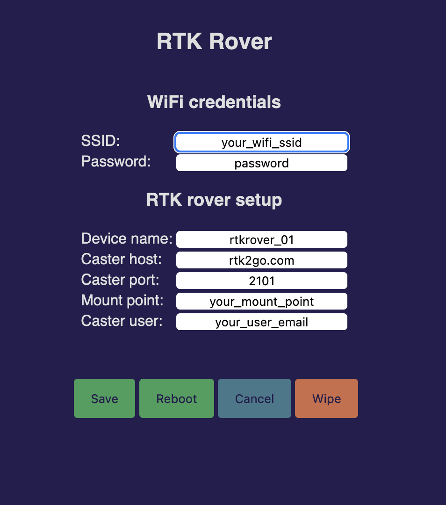

# Real Time Kinematics Rover Manager
### RTKRoverManager

This is a submodule of the [RTKRover](https://github.com/audio-communication-group/RTKRover).

Configure ESP32 WiFi credentials and other default values for your RTK rover project. 
The device runs an access point if no credentials are saved in LittleFS, (SSID: 
"rtkrover"+chipID, IP: 192.168.4.1). Fill the web form with your data, save and reboot.

The mklittlefs file in the root dir you have to [get](https://github.com/earlephilhower/mklittlefs/releases) for for your OS.
Or if you have Arduino IDE installed, you can borrow it from there. On macOS you can find it here: `~/Library/Arduino15/packages/esp32/tools/mklittlefs/3.0.0-gnu12-dc7f933/mklittlefs`. Help for setup the file system you will find [here] (https://randomnerdtutorials.com/esp8266-nodemcu-vs-code-platformio-littlefs/).
This project was created on macOS (silicon). 
